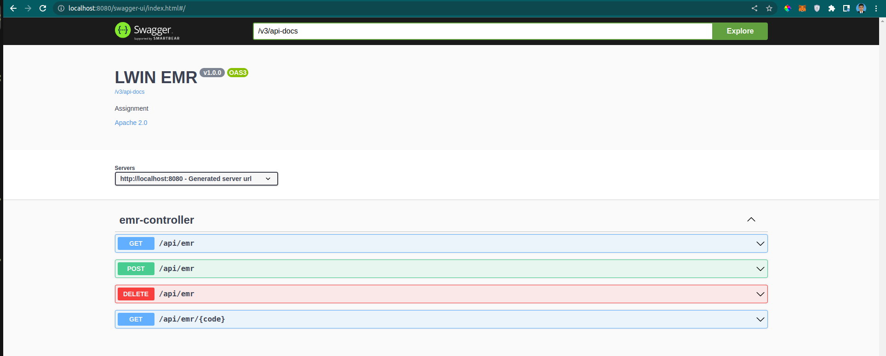
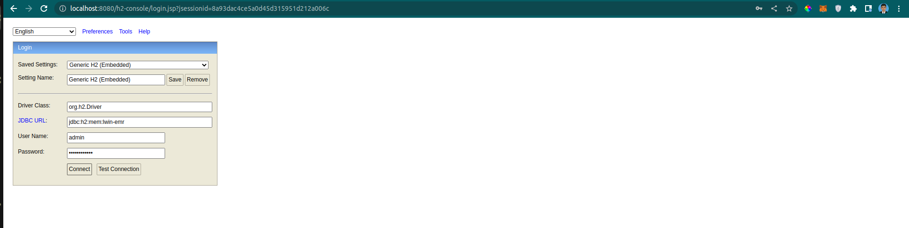
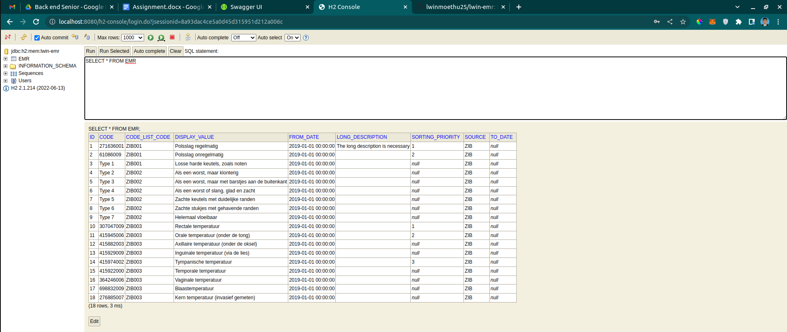

# LWIN EMR (Assignment)

### Getting Started

```
git clone https://github.com/lwinmoethu25/lwin-emr.git
cd ./lwin-emr/
```

### Build Application
For Linux & Mac
```
./gradlew build
```

For Windows
```
gradlew.bat build
```


### Run Application
```
./gradlew bootRun
```

### Run in Docker Container
```
sh start.sh
```

### Swagger
http://localhost:8080/swagger-ui/index.html



### H2
http://localhost:8080/h2-console/login.jsp







### Reference Documentation
For further reference, please consider the following sections:

* [Official Gradle documentation](https://docs.gradle.org)
* [Spring Boot Gradle Plugin Reference Guide](https://docs.spring.io/spring-boot/docs/2.7.5/gradle-plugin/reference/html/)
* [Create an OCI image](https://docs.spring.io/spring-boot/docs/2.7.5/gradle-plugin/reference/html/#build-image)
* [Spring Web](https://docs.spring.io/spring-boot/docs/2.7.5/reference/htmlsingle/#web)

### Guides
The following guides illustrate how to use some features concretely:

* [Building a RESTful Web Service](https://spring.io/guides/gs/rest-service/)
* [Serving Web Content with Spring MVC](https://spring.io/guides/gs/serving-web-content/)
* [Building REST services with Spring](https://spring.io/guides/tutorials/rest/)

### Additional Links
These additional references should also help you:

* [Gradle Build Scans – insights for your project's build](https://scans.gradle.com#gradle)

